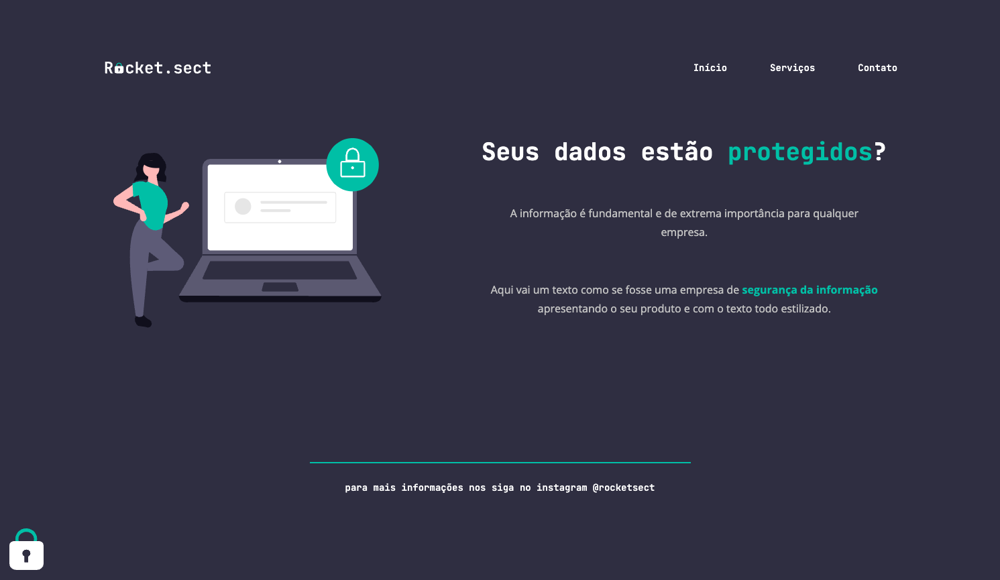

# 💻 Sobre o desafio

Nesse desafio, você deverá recriar uma aplicação, a partir de um layout, para treinar o que aprendeu até agora no **Stage 02**.

## Figma da aplicação

O figma da aplicação está disponível no link abaixo:

[Figma](https://www.figma.com/embed?embed_host=notion&url=https%3A%2F%2Fwww.figma.com%2Ffile%2FEdKjPWjC8ZlbnH4XzTObv2%2FExplorer%3Fnode-id%3D16%253A106)

## Quais arquivos devo criar na minha aplicação?

Além de criar a pasta **images**, que irá conter as imagens da sua aplicação, seu projeto deverá ter os seguintes arquivos:

- _index.html_
- _style.css_

Para facilitar pra você, vou deixar a pasta com as imagens exportadas do Figma por aqui! 💜

[images](https://s3-us-west-2.amazonaws.com/secure.notion-static.com/7cf4910f-11e9-4806-baaf-a7e14b1124b7/Untitled.zip)
